<div align="center">




</div>

---

### `$ whoami`

founder, 23. i build capital-efficient rails for on-chain markets, and a few design-led things on the side. mostly Rust and Solana, Python when the data earns it, TypeScript when it has to ship. everything gets built in public.

---

### `$ ls -la ~/ventures`

```console
drwxr-xr-x   cusp        leverage + credit protocol for prediction markets on solana
drwxr-xr-x   soundwave   encrypted file transfer between nearby devices over fsk audio tones
```

> live: [soundwave transfer](https://sound-waves-file-transfer.unabrijed.xyz) &nbsp;·&nbsp; more coming out of devnet

---

### `$ cat stack.txt`

```yaml
languages:   Rust · TypeScript · Python
chains:      Solana / Anchor · SVM
onchain:     smart contracts · DeFi · oracles · liquidations · leverage
data/ml:     pandas · numpy · trading systems · market microstructure
frontend:    Next.js · React · Tailwind
infra:       Supabase · Helius · Privy · Railway · Cloudflare
```

---

### `$ git log --oneline --author=unabrijed -n 6`

```console
a1f3c9d  (HEAD -> main)  cusp: devnet — leverage surface L_max(p,t) + synthetic fills + chaos replay
c4d9911  drophunt: producthunt-style live feed for cloudflare drop sites, heat-score ranking
2f6b1a3  augury: parametric cover desk reading prediction-market odds as a probability oracle
0d5c8ee  prev: rwa proof-of-reserves + economic audits @ afi protocol / chainrisk
```

---

### `$ curl -s ~/contact`

```http
GET /unabrijed HTTP/1.1
```

[`x.com/unabrijed`](https://x.com/unabrijed) &nbsp;·&nbsp; [`github.com/unabrijed`](https://github.com/unabrijed) &nbsp;·&nbsp; [`youtube.com/@unabrijed`](https://youtube.com/@unabrijed) &nbsp;·&nbsp; [`t.me/unabrijed`](https://t.me/unabrijed) &nbsp;·&nbsp; [`in/brijesh-agal`](https://linkedin.com/in/brijesh-agal) &nbsp;·&nbsp; [`ig/unabrijed`](https://instagram.com/unabrijed)

<div align="center">
<sub><code>unabrijed@github:~$ ./run --build-in-public &</code> <code>[1] running</code></sub>
</div>
